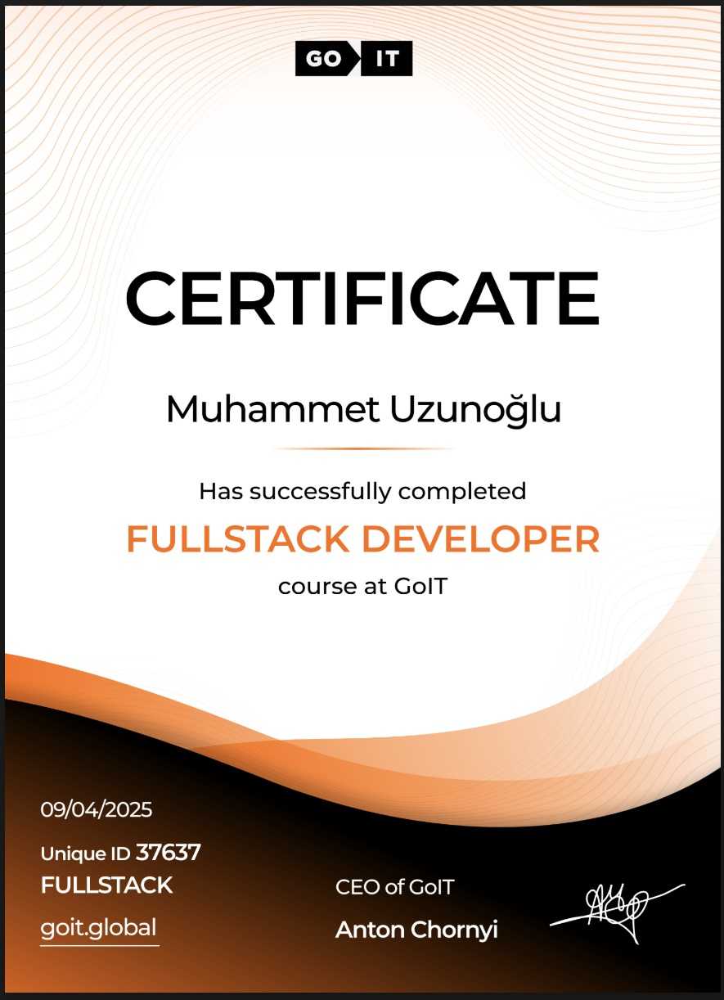

## Fullstack Developer Certificate - GoIT

**Issued by:** GoIT  
**Completion Date:** April 2025  
**Certificate ID:** 37637

### Summary:
- 6 months of intensive training
- Technologies: HTML, CSS, JavaScript, React
- 18 assignments, 3 portfolio projects
- Focused on real-world skills and soft skills development

[View Certificate (PDF)](./goit-fullstack-developer-certificate.pdf)

# certificates
